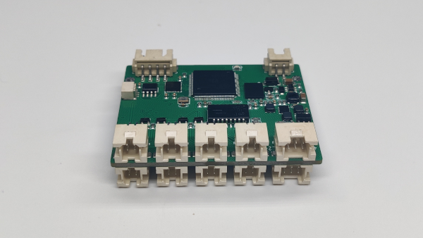
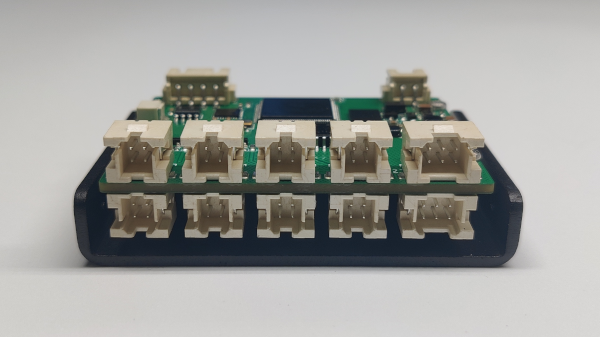
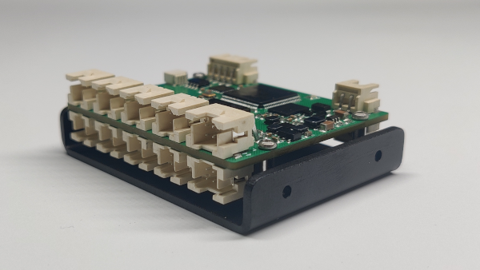
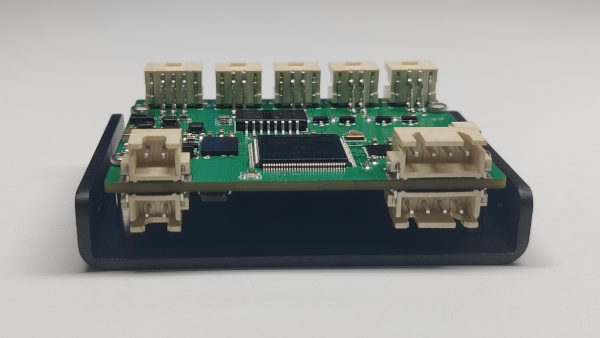
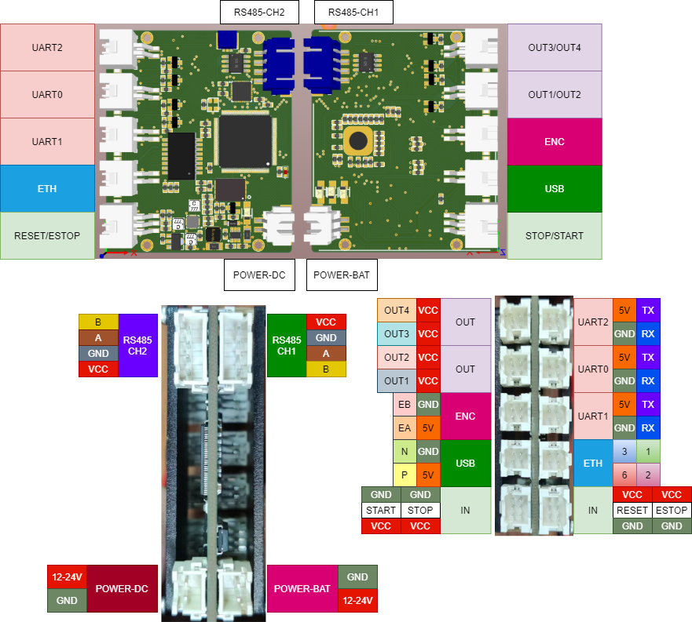

# PyV3s 控制器文档

## 目录
- [简介](#简介)
- [资源特性](#资源特性)
- [产品细节](#产品细节)
- [配件介绍](#配件介绍)
- [机械尺寸](#机械尺寸)
- [接口布局](#接口布局)
- [开发指南](#开发指南)
- [参考示例](#参考示例)
- [相关视频](#相关视频)

## 简介



PyV3s是DBD团队开发的一款超小型Python控制器，具有以下特点：

### 核心特性
- **超小尺寸**：仅50mm × 60mm
- **高性能处理器**：全志科技V3s (ARM Cortex-A7)，主频1GHz
- **内存配置**：64M内存，512M存储空间
- **操作系统**：基于buildroot的主线Linux系统
- **协处理器**：ARM Cortex-M0，负责实时通信和编码器数据处理

### 接口配置
- 百兆以太网接口 × 1
- USB2.0接口 × 1
- TTL串口 × 2路
- AB增量编码器接口 × 1路
- 数字输入 × 4路
- 数字输出 × 4路
- RS485通信 × 2路
- 主电源/备用电源接口
- **编程语言**：支持Python编程

* * *

## 资源特性

| 参数 | 规格 |
|------|------|
| **重量** | 7.2g |
| **适配设备** | 全系列Bee电机驱动器/IO板/灯光控制器/编码器 |
| **工作电压** | DC 12V/24V |
| **最大持续输出电流** | 200mA |
| **状态指示灯** | 蓝色 |
| **USB总线速度** | 480Mbps |
| **以太网速度** | 100Mbps |
| **RS485总线速度** | 250Kbps/500Kbps |
| **运行温度** | -10°C ~ +60°C |  
  
## 产品细节

  

## 配件介绍

### 标准配件清单
- **电源线**：用于12V/24V直流供电
- **网口线**：用于以太网通信连接
- **TTL串口线**：用于串口通信和调试
- **USB线**：用于USB通信和数据传输
- **IO输入线**：用于连接输入传感器
- **IO输出线**：用于连接输出设备
- **编码器线**：用于连接增量编码器

## 机械尺寸

> 详细尺寸图纸请参考产品规格书

## 接口布局



### 供电接口

| 参数 | 规格 |
|------|------|
| **供电电压** | 12V/24V DC |
| **接插件** | XH2.54-2P |
| **最大电流** | <3A |
| **备用电源** | 12V/24V DC |  
  
### RS485通信接口

| 参数 | 规格 |
|------|------|
| **对外供电电压** | 5V DC |
| **接插件** | XH2.54-4P |
| **通道数** | 2 |
| **波特率** | 250Kbps |

### 以太网通信接口

| 参数 | 规格 |
|------|------|
| **通信速率** | 100Mbps |
| **IP地址(静态)** | 192.168.10.22 |
| **接插件** | PHB2.0-2x2 |

### USB通信接口

| 参数 | 规格 |
|------|------|
| **通信速率** | 480Mbps |
| **接插件** | PHB2.0-2x2 |  
  
### UART0通信接口

| 参数 | 规格 |
|------|------|
| **通信速率** | 115200bps |
| **接插件** | PHB2.0-2x2 |
| **功能** | 串口调试终端，可用putty连接 |

### UART1通信接口

| 参数 | 规格 |
|------|------|
| **通信速率** | 自定义 |
| **接插件** | PHB2.0-2x2 |
| **功能** | 自定义 |
| **端口** | /dev/ttyS1 |

### UART2通信接口

| 参数 | 规格 |
|------|------|
| **通信速率** | 自定义 |
| **接插件** | PHB2.0-2x2 |
| **功能** | 自定义 |
| **端口** | /dev/ttyS2 |  
  
### IO输出接口

| 参数 | 规格 |
|------|------|
| **通道数** | 4 |
| **接插件** | PHB2.0-2x2 |
| **功能** | 自定义 |
| **输出类型** | 开漏输出（低电平有效） |

### IO输入接口

| 参数 | 规格 |
|------|------|
| **通道数** | 4 |
| **接插件** | PHB2.0-2x3 |
| **功能** | 自定义 |
| **输入类型** | 内部上拉（低电平有效，配合NPN类型接近开关） |  
  
## 开发指南

### 常用开发工具

| 工具 | 用途 |
|------|------|
| **VsCode** | 代码编辑和开发环境 |
| **WinScp** | 文件传输工具 |
| **MobaXterm** | SSH终端和X11服务器 |
| **Putty** | SSH终端连接工具 |

### 最新库文件下载

- [libpro.py](python/libpro.py) - 主要功能库
- [libio.py](python/libio.py) - IO控制库

### 连接方式

#### USB串口终端登录
> 详细步骤请参考用户手册

#### 网口登录控制器
> 默认IP地址：192.168.10.22

#### VsCode开发环境配置
> 支持远程开发和代码同步

#### WinSCP文件传输
> 用于上传/下载代码文件

#### MobaXTerm使用
> 集成SSH和文件传输功能

### Python代码运行

登录系统后，使用以下命令运行Python代码：

```bash
python3 your_script.py
```

将 `your_script.py` 替换为您要运行的文件名。

### 开机自动运行设置

要设置开机自动运行Python代码，需要修改文件 `/etc/init.d/S60motion`：

1. 找到以下行并去掉注释符号 `#`：
   ```bash
   #nohup /usr/bin/python3 /root/motion.py &
   ```

2. 将 `motion.py` 替换为您要启动的文件名

3. **注意**：程序中所有涉及到路径的地方都需要使用绝对路径

**完整的S60motion脚本示例：**

```bash
#!/bin/sh
#
# Starts DBD Motion
#

# Allow a few customizations from a config file

start() {
    /sbin/insmod /root/hello.ko
    # printf "start motion..."
    # sleep 1
    nohup /usr/bin/python3 /root/your_script.py &
    # printf "start demo..."
}

stop() {
    printf "Stopping motion"
}

restart() {
    stop
    start
}

case "$1" in
  start)
    start
    ;;
  stop)
    stop
    ;;
  restart|reload)
    restart
    ;;
  *)
    echo "Usage: $0 {start|stop|restart}"
    exit 1
esac

exit $?
```

### IO接口使用示例

#### 输入IO使用

PyV3s控制器拥有4个IO输入端口，硬件连接注意事项：
- 传感器选用NPN类型
- 支持常开或常闭触点
- 内部已配置上拉电阻

**代码示例：**

```python
from libio import GPIO
import time

io = GPIO()

for loop in range(0, 100):
    ret = io.getInput()
    if ret & 0x1:
        print("Button 0 pressed")
    if ret & 0x2:
        print("Button 1 pressed")
    if ret & 0x4:
        print("Button 2 pressed")
    if ret & 0x8:
        print("Button 3 pressed")
    time.sleep(0.1)
```

#### 输出IO使用

> 输出IO为开漏输出，低电平有效，可用于控制继电器、LED等设备

#### TTL串口使用 (ttyS1/ttyS2)

**代码示例：**

```python
import serial
import time

portName = '/dev/ttyS2'

# 初始化串口
port = serial.Serial(portName, 9600, timeout=0.1)

# 构建消息数据
message = bytearray(8)
message[0] = 0x01  # 设备地址
message[1] = 0x03  # 功能码
message[2] = 0x00  # 起始地址高位
message[3] = 0x00  # 起始地址低位
message[4] = 0x00  # 寄存器数量高位
message[5] = 0x03  # 寄存器数量低位
message[6] = 0x05  # CRC校验低位
message[7] = 0xCB  # CRC校验高位

# 循环发送和接收数据
for loop in range(0, 100):
    port.write(message)
    time.sleep(1)
    ret = port.read(11)
    print(f"Received: {ret}")

# 关闭串口
port.close()
```

### USB接口使用

USB接口支持标准USB设备连接，如USB摄像头、USB存储设备等。

**代码示例：**

```python
import os
import subprocess

# 检测USB设备
result = subprocess.run(['lsusb'], capture_output=True, text=True)
print("USB设备列表：")
print(result.stdout)

# 挂载USB存储设备
os.system('mount /dev/sda1 /mnt/usb')
```

### RS485总线控制电机运行

RS485总线支持多设备通信，可用于控制步进电机、伺服电机等设备。

**代码示例：**

```python
import serial
import time

# 初始化RS485通信
rs485 = serial.Serial('/dev/ttyS1', 9600, timeout=0.1)

# 电机控制命令
def motor_control(device_id, speed, direction):
    cmd = bytearray([device_id, 0x06, speed, direction, 0x00, 0x00])
    rs485.write(cmd)
    response = rs485.read(8)
    return response

# 控制电机运行
motor_control(0x01, 100, 1)  # 设备1，速度100，正向
time.sleep(2)
motor_control(0x01, 0, 0)    # 停止
```

### 外部IO模块扩展

可通过RS485或其他通信方式扩展更多IO接口。

**代码示例：**

```python
from libio import GPIO
import serial

# 本地IO
local_io = GPIO()

# 扩展IO模块通信
extend_io = serial.Serial('/dev/ttyS2', 9600)

def read_extend_io(module_id, channel):
    cmd = bytearray([module_id, 0x01, channel])
    extend_io.write(cmd)
    response = extend_io.read(4)
    return response[3] if len(response) >= 4 else 0

# 读取扩展IO状态
status = read_extend_io(0x02, 0x01)
print(f"扩展IO状态: {status}")
```

### 灯光控制模块

支持PWM调光、RGB灯带控制等功能。

**代码示例：**

```python
import time
from libio import GPIO

io = GPIO()

# PWM调光控制
def pwm_light_control(brightness):
    """brightness: 0-255"""
    duty_cycle = brightness / 255.0
    # 通过IO输出控制PWM
    for i in range(100):
        if i < duty_cycle * 100:
            io.setOutput(0x01)  # 输出高电平
        else:
            io.setOutput(0x00)  # 输出低电平
        time.sleep(0.0001)

# RGB灯带控制
def rgb_control(r, g, b):
    """RGB值控制"""
    rgb_data = bytearray([0xFF, r, g, b, 0x00, 0xFF])
    # 通过串口发送RGB数据
    return rgb_data

# 渐变效果
for brightness in range(0, 256, 5):
    pwm_light_control(brightness)
    time.sleep(0.1)
```

## 参考示例
### 项目案例

## 相关视频
### 教程视频
- [pyv3s 控制器运行自定义轨迹](https://www.bilibili.com/video/BV1Re4de3Exe/?vd_source=1bf81de6c7b29ab112e8d99bca0303d8)
- [如何使用板载 io 输出](https://www.bilibili.com/video/BV18oHkenEic/?vd_source=1bf81de6c7b29ab112e8d99bca0303d8)
- [写一段代码 让电机运行起来](https://www.bilibili.com/video/BV12eH5eaEeC/?vd_source=1bf81de6c7b29ab112e8d99bca0303d8)
- [修改一下代码 让两个电机跑起来](https://www.bilibili.com/video/BV12YH5eAE2V/?vd_source=1bf81de6c7b29ab112e8d99bca0303d8)
- [如何连接两台电机](https://www.bilibili.com/video/BV1q1HgeBEcH/?vd_source=1bf81de6c7b29ab112e8d99bca0303d8)
- [如何扫描和修改 ID](https://www.bilibili.com/video/BV1BkHge6Ev9/)
- [如何使用 winscp 工具进行上传和下载文件](https://www.bilibili.com/video/BV1hMsVeGEYU/?vd_source=1bf81de6c7b29ab112e8d99bca0303d8)
- [如何使用 vscode 编写上传运行代码](https://www.bilibili.com/video/BV1kAsGedEMx/?vd_source=1bf81de6c7b29ab112e8d99bca0303d8)
- [如何使用以太网接口登录控制器](https://www.bilibili.com/video/BV11ds3ehEmq/)
- [如何使用 TTL 串口线登录 PyV3s 控制器](https://www.bilibili.com/video/BV1ZEsNeYEW2/?vd_source=1bf81de6c7b29ab112e8d99bca0303d8)